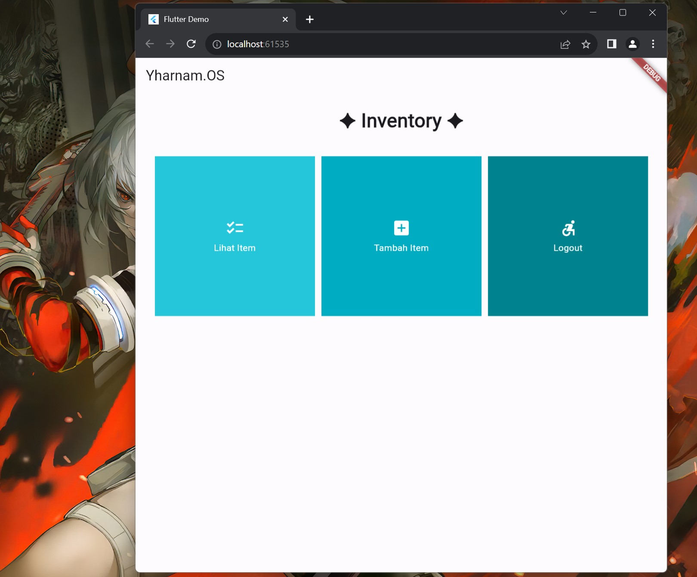

# inventory_mobile

A new Flutter project.

## Getting Started

This project is a starting point for a Flutter application.

A few resources to get you started if this is your first Flutter project:

- [Lab: Write your first Flutter app](https://docs.flutter.dev/get-started/codelab)
- [Cookbook: Useful Flutter samples](https://docs.flutter.dev/cookbook)

For help getting started with Flutter development, view the
[online documentation](https://docs.flutter.dev/), which offers tutorials,
samples, guidance on mobile development, and a full API reference.

# TUGAS 7

1. 
a. Stateless Widgets :
	* Tidak memiliki state atau "keadaaan", tidak dapat berubah sendirinya dari sebuah aksi internal atau behavior lain.
	* Berubah karena event atau aksi dari entity luar dari parent widget dalam widget tree.
	* Memberikan kembali bagaimana mereka dibangun kepada beberapa parent widget dalam struktur.
	* Child widget akan menerima deskripsi dari parent widget dan tidak berubah oleh sendirinya.
	* Hanya memiliki property final terdefinisi dalam construction, dan hanya membutuhkan tersebut yang dibangun di layar device.

b. Stateful widget :
	* Mengubah deskripsinya dalam jangka waktu hidupnya/lifespannya.
	* Immutable, namun memiliki company State class yang merepresentasikan keadaan/state widget sekarang.

<br>
<br>

2. Widgets used :

MaterialApp: Biasanya digunakan untuk membungkus aplikasi dan menetapkan properti global seperti judul, tema, dan navigasi.

Scaffold: Menyediakan struktur dasar untuk sebuah halaman, termasuk AppBar dan body.

AppBar: Bagian atas aplikasi yang menampilkan judul atau teks tertentu.

SingleChildScrollView: Memungkinkan konten di dalamnya untuk discroll jika melebihi ukuran layar yang tersedia.

Padding: Menambahkan padding ke dalam widget.

Column: Menyusun widget secara vertikal.

GridView: Menampilkan widget dalam grid.

InkWell: Memberikan efek sentuhan responsif saat di-tap.

Container: Mengelompokkan widget, memungkinkan konfigurasi seperti padding, warna, dan lainnya.

Icon: Menampilkan ikon sesuai dengan nilai IconData yang diberikan.

Text: Menampilkan teks dengan berbagai konfigurasi seperti style, ukuran, warna, dll.

SnackBar: Pop-up pesan yang muncul untuk memberikan umpan balik singkat setelah suatu tindakan.

<br>
<br>

3. Step by step checklist implementation :

- Setup flutter dengan menginstallnya dan memenuhi dependensinya (Android SDK/Android Studio, Android licenses, dan Visual Studio) -> Setup path dalam device

- Create new folder untuk menampung proyek flutter baru :
`flutter assignments` -> Di dalamnya, buka cmd folder dan run command berikut :
	* flutter create inventory_mobile 
ini akan membuat file - file proyek baru secara otomatis 

```
android/
ios/
lib/main.dart
test/
.gitignore
.metadata
.packages
pubspec.yaml
pubspec.lock
README.md
analysis_options.yaml
LICENSE
CNAME
```
- Pada `lib/main.dart` akan disediakan suatu template yang dapat digunakan untuk membangun aplikasi lebih lanjut (main.dart menampilkan sebuah template app dengan tombol dan counter dimana tombol akan increment counter pada layar)

- Pada `lib/` create new file dengan open notepad -> `ctrl + s` -> all files, save dengan nama `menu.dart`.
menu.dart akan digunakan sebagai tempat dimana interface menu diletakkan, main akan hanya memanggil function yang kita butuhkan saat dibutuhkan, atau abstraksi/pemisahan fitur.

- Ubah main.dart menjadi

```dart
import 'package:flutter/material.dart';
import 'package:inventory_mobile/menu.dart';

void main() {
  runApp(const MyApp());
}

class MyApp extends StatelessWidget {
  const MyApp({super.key});

  @override
  Widget build(BuildContext context) {
    return MaterialApp(
      title: 'Flutter Demo',
      theme: ThemeData(

        colorScheme: ColorScheme.fromSeed(seedColor: Colors.indigo),
        useMaterial3: true,
      ),
      home: MyHomePage(),
    );
  }
}
```

dan menu.dart menjadi :

```dart
import 'package:flutter/material.dart';
import 'package:inventory_mobile/menu.dart';

class MyHomePage extends StatelessWidget {
  MyHomePage({Key? key}) : super(key: key);

  final List<ShopItem> items = [
      ShopItem.lihatItem, // Use the predefined instances with different colors
      ShopItem.tambahItem,
      ShopItem.logout,
  ];

  @override
  Widget build(BuildContext context) {
    return Scaffold(
      appBar: AppBar(
        title: const Text(
          'Yharnam.OS',
        ),
      ),
      body: SingleChildScrollView(
        child: Padding(
          padding: const EdgeInsets.all(10.0), 
          child: Column(
            children: <Widget>[
              const Padding(
                padding: EdgeInsets.only(top: 10.0, bottom: 10.0),
                child: Text(
                  '✦ Inventory ✦', 
                  textAlign: TextAlign.center,
                  style: TextStyle(
                    fontSize: 30,
                    fontWeight: FontWeight.bold,
                  ),
                ),
              ),
              // Grid layout
              GridView.count(
                primary: true,
                padding: const EdgeInsets.all(20),
                crossAxisSpacing: 10,
                mainAxisSpacing: 10,
                crossAxisCount: 3,
                shrinkWrap: true,
                children: items.map((ShopItem item) {
                  return ShopCard(item);
                }).toList(),
              ),
            ],
          ),
        ),
      ),
    );
  }
}

class ShopItem {
  final String name;
  final IconData icon;
  final Color color;

  // Constructor
  ShopItem(this.name, this.icon, this.color);

  // Define setiap constructor dengan benar sesuai format. Bedakan tiap warna
  static final ShopItem lihatItem = ShopItem("Lihat Item", Icons.checklist, Colors.cyan[400]!);
  static final ShopItem tambahItem = ShopItem("Tambah Item", Icons.add_box, Colors.cyan[600]!);
  static final ShopItem logout = ShopItem("Logout", Icons.accessible_forward_sharp, Colors.cyan[800]!);
}

class ShopCard extends StatelessWidget {
  final ShopItem item;

  const ShopCard(this.item, {super.key}); // Constructor

  @override
  Widget build(BuildContext context) {
    return Material(
      color: item.color,
      child: InkWell(
        // Area responsive terhadap sentuhan
        onTap: () {
          // Memunculkan SnackBar ketika diklik
          ScaffoldMessenger.of(context)
            ..hideCurrentSnackBar()
            ..showSnackBar(SnackBar(
                content: Text("Kamu telah menekan tombol ${item.name}!")));
        },
        child: Container(
          // Container untuk menyimpan Icon dan Text
          padding: const EdgeInsets.all(8),
          child: Center(
            child: Column(
              mainAxisAlignment: MainAxisAlignment.center,
              children: [
                Icon(
                  item.icon,
                  color: Colors.white,
                  size: 30.0,
                ),
                const Padding(padding: EdgeInsets.all(3)),
                Text(
                  item.name,
                  textAlign: TextAlign.center,
                  style: const TextStyle(color: Colors.white),
                ),
              ],
            ),
          ),
        ),
      ),
    );
  }
}
```

- App Flutter dapat dijalankan dengan :
Membuka folder app (`inventory_mobile`) -> run cmd -> jalankan perintah `flutter run` -> saat diberi pilihan, pilihlah sesuai kebutuhan, misal untuk ini chrome, tekan `2`, program akan memakai waktu sedikit lama untuk compile code dan connect ke browser pilihan

- Tampilan akan terlihat seperti berikut :



- Jika sudah selesai operasi app, matikan dengan perintah `q` pada cmd (sesuai pada cmd)

- create new repo, git init, git add ., git commit, git push

<br>


